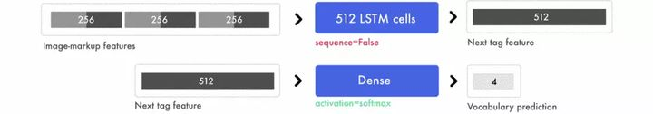

Tác giả: Emil Wallner
# https://blog.floydhub.com/turning-design-mockups-into-code-with-deep-learning/
# https://zhuanlan.zhihu.com/p/32947732
# https://machinelearningmastery.com/develop-a-caption-generation-model-in-keras/

 


Tổng hợp:
   - Làm thế nào để sử dụng nguyên mẫu trang front-end để tạo mã tương ứng luôn là mối quan tâm của chúng tôi. 

   - Tác giả của bài viết này đã xây dựng một mô hình tạo mã front-end mạnh mẽ dựa trên pix2code và các tài liệu khác, 

   - đồng thời giải thích chi tiết cách sử dụng LSTM và CNN để viết nguyên mẫu thiết kế vào các trang web HTML và CSS.

Liên kết dự án: https://github.com/emilwallner/Screenshot-to-code-in-Keras

Trong ba năm tới, học sâu sẽ thay đổi sự phát triển của front-end. 

Nó sẽ tăng tốc độ tạo mẫu và hạ thấp các rào cản đối với việc phát triển phần mềm.


### Tony Beltramelli phát hành giấy "pix2code:
   - Tạo Mã từ một người dùng đồ họa giao diện chụp màn hình" vào năm ngoái,
   - và Airbnb cũng phát hành Sketch2code ( https://airbnb.design/sketching-interfaces/).

### Hiện tại, trở ngại lớn nhất đối với sự phát triển giao diện người dùng tự động là :
 -  sức mạnh tính toán. 
 -  Nhưng chúng ta đã có thể sử dụng các thuật toán học sâu hiện tại 
 -  và dữ liệu đào tạo tổng hợp để khám phá phương pháp trí tuệ nhân tạo để tự động xây dựng giao diện người dùng.
 
 ### Trong bài viết này, tác giả sẽ hướng dẫn :
   -  các mạng nơ-ron cách viết một trang web HTML 
   -  và CSS dựa trên một bức tranh và một mẫu thiết kế.
   

### Sau đây là tổng quan ngắn gọn về quy trình:

1) Nhập bản vẽ thiết kế vào mạng nơ-ron được đào tạo

   
  

2) Mạng nơ-ron chuyển đổi hình ảnh sang ngôn ngữ đánh dấu HTML

  

   

3) Kết xuất đầu ra


### ta sẽ xây dựng ba mô hình khác nhau từ dễ đến khó trong ba bước Đầu tiên :
  - Phiên bản đơn giản nhất để làm chủ các bộ phận chuyển động.
  - Phiên bản thứ hai của HTML tập trung vào việc tự động hóa tất cả các bước và giải thích ngắn gọn về lớp mạng thần kinh.
  -  Trong phiên bản Bootstrap cuối cùng, chúng ta sẽ tạo một mô hình để suy nghĩ và khám phá lớp LSTM.

Địa chỉ mã:
https://github.com/emilwallner/Screenshot-to-code-in-Keras


Việc xây dựng mô hình trong bài viết này dựa trên bài báo của Beltramelli "pix2code: 
  - Tạo mã từ ảnh chụp màn hình giao diện người dùng đồ họa" 
  - và hướng dẫn tạo mô tả bằng hình ảnh của Jason Brownlee, 
  - và được hoàn thành bằng Python và Keras.


### Logic cốt lõi

Mục tiêu là xây dựng một mạng nơ-ron có thể tạo ngôn ngữ đánh dấu HTML / CSS tương ứng với ảnh chụp màn hình.

Khi đào tạo mạng nơ-ron :
  - trước tiên bạn cung cấp một vài ảnh chụp màn hình 
  - và mã HTML tương ứng. 
  
Web học bằng cách dự đoán từng ngôn ngữ đánh dấu HTML phù hợp.
Khi dự đoán nhãn của ngôn ngữ đánh dấu tiếp theo, mạng sẽ nhận được ảnh chụp màn hình và tất cả các dấu chính xác trước đó.


Đây là ví dụ về dữ liệu đào tạo đơn giản: https://docs.google.com/spreadsheets/d/1xXwarcQZAHluorveZsACtXRdmNFbwGtN3WMNhcTdEyQ/edit?Usp=sharing.


Tạo mô hình dự đoán từng từ là phương pháp được sử dụng phổ biến nhất hiện nay và đây cũng là phương pháp được sử dụng trong hướng dẫn này.

Lưu ý: Mạng nơ-ron nhận được cùng một ảnh chụp màn hình mỗi khi nó đưa ra dự đoán.

 Nói cách khác, nếu mạng cần dự đoán 20 từ, nó sẽ nhận được 20 ảnh chụp màn hình của cùng một thiết kế. 
 
 Bây giờ, bất kể nguyên lý hoạt động của mạng nơ-ron là gì, bạn chỉ cần tập trung vào đầu vào và đầu ra của mạng nơ-ron.


 


### Đầu tiên chúng ta hãy nhìn vào đánh dấu trước đó. 

Giả sử mục đích của việc huấn luyện mạng nơ-ron là dự đoán câu "Tôi có thể viết mã". 

Khi mạng nhận được "tôi", hãy dự đoán "có thể". 

Lần tới, mạng nhận được "Tôi có thể" và dự đoán "mã". 

Nó nhận tất cả các từ trước đó, nhưng chỉ dự đoán từ tiếp theo.


### Mạng nơ-ron tạo ra các tính năng từ dữ liệu. 

Mạng nơ-ron xây dựng các tính năng để kết nối dữ liệu đầu vào và dữ liệu đầu ra.

Nó phải tạo ra các biểu diễn để hiểu nội dung của từng ảnh chụp màn hình và cú pháp HTML mà nó cần dự đoán. 

Đây là tất cả những kiến ​​thức xây dựng để dự đoán thẻ tiếp theo.

Áp dụng mô hình được đào tạo vào thế giới thực tương tự như quy trình đào tạo mô hình.

ta không cần nhập đánh dấu HTML chính xác, mạng sẽ nhận được đánh dấu mà nó hiện tạo ra và dự đoán đánh dấu tiếp theo.

Dự đoán bắt đầu từ "thẻ bắt đầu" và kết thúc bằng "thẻ đóng" hoặc kết thúc khi đạt đến giới hạn tối đa.


 
### Phiên bản Hello World

Bây giờ chúng ta hãy xây dựng triển khai phiên bản Hello World. 

Ta sẽ cung cấp ảnh chụp màn hình có từ "Hello World!" Cho mạng nơ-ron và đào tạo nó để tạo ra ngôn ngữ đánh dấu tương ứng.


Đầu tiên:
 -  mạng nơ-ron chuyển đổi thiết kế nguyên mẫu thành một tập hợp các giá trị pixel
 -  Và mỗi pixel có ba kênh RGB và giá trị của mỗi kênh nằm trong khoảng 0-255.
 


### Để biểu diễn những điểm đánh dấu này theo cách mà mạng nơ-ron có thể hiểu được ---> tôi đã sử dụng mã hóa một nóng.

 Do đó, câu "I can code" có thể được ánh xạ thành dạng sau.


Trong hình trên, mã của ta chứa thẻ bắt đầu và thẻ kết thúc. 

Các thẻ này có thể cung cấp cho mạng nơ-ron thông tin vị trí để bắt đầu và kết thúc dự đoán. 

Sau đây là các kết hợp khác nhau của các thẻ này và mã hóa One-hot tương ứng.


 

ta sẽ thực hiện thay đổi vị trí của từng từ trong mỗi vòng luyện tập, 

vì vậy điều này cho phép người mẫu học theo trình tự thay vì ghi nhớ vị trí của từ. 

Có bốn dự đoán trong hình dưới đây và mỗi hàng là một dự đoán. 

Và bên trái đại diện cho kênh ba màu RGB và từ trước đó, 
và bên phải đại diện cho kết quả dự đoán và nhãn kết thúc màu đỏ.


``` python
#Length of longest sentence
   max_caption_len = 3
#Size of vocabulary 
   vocab_size = 3

# Load one screenshot for each word and turn them into digits 
   images = []
for i in range(2):
       images.append(img_to_array(load_img('screenshot.jpg', target_size=(224, 224))))
   images = np.array(images, dtype=float)
# Preprocess input for the VGG16 model
   images = preprocess_input(images)

#Turn start tokens into one-hot encoding
   html_input = np.array(
               [[[0., 0., 0.], #start
                [0., 0., 0.],
                [1., 0., 0.]],
                [[0., 0., 0.], #start <HTML>Hello World!</HTML>
                [1., 0., 0.],
                [0., 1., 0.]]])

#Turn next word into one-hot encoding
   next_words = np.array(
               [[0., 1., 0.], # <HTML>Hello World!</HTML>
                [0., 0., 1.]]) # end

# Load the VGG16 model trained on imagenet and output the classification feature
   VGG = VGG16(weights='imagenet', include_top=True)
# Extract the features from the image
   features = VGG.predict(images)

#Load the feature to the network, apply a dense layer, and repeat the vector
   vgg_feature = Input(shape=(1000,))
   vgg_feature_dense = Dense(5)(vgg_feature)
   vgg_feature_repeat = RepeatVector(max_caption_len)(vgg_feature_dense)
# Extract information from the input seqence 
   language_input = Input(shape=(vocab_size, vocab_size))
   language_model = LSTM(5, return_sequences=True)(language_input)

# Concatenate the information from the image and the input
   decoder = concatenate([vgg_feature_repeat, language_model])
# Extract information from the concatenated output
   decoder = LSTM(5, return_sequences=False)(decoder)
# Predict which word comes next
   decoder_output = Dense(vocab_size, activation='softmax')(decoder)
# Compile and run the neural network
   model = Model(inputs=[vgg_feature, language_input], outputs=decoder_output)
   model.compile(loss='categorical_crossentropy', optimizer='rmsprop')

# Train the neural network
   model.fit([features, html_input], next_words, batch_size=2, shuffle=False, epochs=1000)
```


### Trong phiên bản Hello World :
  - ta sử dụng ba ký hiệu "start", "Hello World" và "end".

Các mô hình cấp ký tự yêu cầu lượng từ vựng nhỏ hơn và các mạng nơ-ron bị hạn chế, trong khi các ký hiệu cấp từ có thể có hiệu suất tốt hơn ở đây.


#### Sau đây là mã để thực hiện dự đoán:

```python
# Create an empty sentence and insert the start token
   sentence = np.zeros((1, 3, 3)) # [[0,0,0], [0,0,0], [0,0,0]]
   start_token = [1., 0., 0.] # start
   sentence[0][2] = start_token # place start in empty sentence

# Making the first prediction with the start token
   second_word = model.predict([np.array([features[1]]), sentence])

# Put the second word in the sentence and make the final prediction
   sentence[0][1] = start_token
   sentence[0][2] = np.round(second_word)
   third_word = model.predict([np.array([features[1]]), sentence])

# Place the start token and our two predictions in the sentence 
   sentence[0][0] = start_token
   sentence[0][1] = np.round(second_word)
   sentence[0][2] = np.round(third_word)

# Transform our one-hot predictions into the final tokens
   vocabulary = ["start", "<HTML><center><H1>Hello World!</H1></center></HTML>", "end"]
for i in sentence[0]:
print(vocabulary[np.argmax(i)], end=' ')
```

### Đầu ra : 
   - 10 kỷ nguyên: ```start start start ```
   - 100 kỷ nguyên: ``` start <HTML> <center> <H1> Hello World! </H1> </center> </HTML> <HTML> <center> <H1> Hello World! </H1> </center> </ HTML> ```
   - 300 kỷ nguyên: ```start <HTML> <center> <H1> Hello World! </H1> </center> </HTML> end ```


### Những cái hố tôi đã đi qua:
 - Xây dựng phiên bản đầu tiên trước khi thu thập dữ liệu. 
   Trong giai đoạn đầu của dự án này, tôi đã quản lý để có được một kho lưu trữ của phiên bản cũ của trang web lưu trữ Geocities, có 38 triệu trang web. 
   Nhưng tôi đã bỏ qua khối lượng công việc khổng lồ cần thiết để giảm kích thước 100K từ vựng.

 - Đào tạo một terabyte dữ liệu đòi hỏi phần cứng tuyệt vời hoặc sự kiên nhẫn cao độ. 
   Sau khi gặp một số sự cố với máy Mac của mình, cuối cùng tôi đã sử dụng một máy chủ từ xa mạnh mẽ. 
   Tôi dự kiến ​​sẽ thuê 8 CPU hiện đại và 1 liên kết nội bộ GPS để chạy quy trình làm việc của mình.
   
 - Trước khi hiểu dữ liệu đầu vào và đầu ra, các phần khác xem như đã hiểu. 
 Đầu vào X là ảnh chụp màn hình và nhãn được đánh dấu trước đó 
 và đầu ra Y là nhãn được đánh dấu tiếp theo. 
 
 Khi tôi hiểu điều này, các vấn đề khác sẽ dễ dàng làm rõ hơn. 
 
 Ngoài ra, việc thử các kiến ​​trúc khác nhau sẽ dễ dàng hơn.

 - Mạng mã hình ảnh thực sự là một mô hình tự động mô tả hình ảnh. Mặc dù tôi nhận ra điều này, tôi vẫn bỏ lỡ rất nhiều bài báo về tóm tắt hình ảnh tự động vì chúng trông không đủ hấp dẫn. Một khi tôi nhận ra điều này, sự hiểu biết của tôi về không gian vấn đề trở nên sâu sắc hơn.


#### Chạy mã trên FloydHub

FloydHub là một nền tảng đào tạo học sâu. 

Tôi đã biết về nó từ khi tôi bắt đầu học sâu. 

Tôi cũng sử dụng nó để đào tạo và quản lý các thử nghiệm học sâu.

ta có thể cài đặt nó và chạy mô hình đầu tiên trong 10 phút. 
Đây là lựa chọn tốt nhất cho các mô hình đào tạo trên GPU đám mây. 
Nếu độc giả chưa từng sử dụng FloydHub, họ có thể cài đặt và hiểu nó trong khoảng 10 phút.

Địa chỉ FloydHub: https://www.Floydhub.com/

Sao chép Repo:
https://github.com/emilwallner/Screenshot-to-code-in-Keras.git

### Đăng nhập và khởi tạo công cụ dòng lệnh FloydHub:

```
cd Screenshot-to-code-in-Keras
floyd login
floyd init s2c
```

Chạy máy tính xách tay Jupyter trên máy GPU đám mây FloydHub:
```
floyd run --gpu --env tensorflow-1.4 --data emilwallner/datasets/imagetocode/2:data --mode jupyter
```


Tất cả sổ ghi chép được đặt trong thư mục floydbub. 
Khi ta bắt đầu chạy mô hình, sổ ghi chép đầu tiên có thể được tìm thấy dưới 
```
floydhub/Helloworld/helloworld.ipynb. 
```

Để biết thêm chi tiết, vui lòng kiểm tra các cờ đầu của dự án này.
 
## Phiên bản HTML


Trong phiên bản này:
-   Ta sẽ tập trung vào và tạo ra một mô hình mạng nơ-ron có thể mở rộng.
-   Phiên bản này không thể dự đoán HTML trực tiếp từ các trang web ngẫu nhiên,
-   nhưng nó là một bước không thể thiếu để khám phá các vấn đề động.


## Tổng quat


Nếu chúng ta mở rộng kiến ​​trúc trước đó thành cấu trúc được hiển thị trong hình bên phải sau, thì nó có thể xử lý quá trình nhận dạng và chuyển đổi hiệu quả hơn.


### Kiến trúc chủ yếu có hai phần là bộ mã hóa và bộ giải mã: 
-  Bộ mã hóa là phần mà ta  tạo các đặc điểm hình ảnh và các đặc điểm đánh dấu trước đó.
-   Các tính năng là các khối xây dựng của kết nối giữa tạo mẫu mạng và ngôn ngữ đánh dấu.
-    Ở cuối bộ mã hóa, ta chuyển các đặc điểm hình ảnh cho từng từ được đánh dấu trước đó. 
-    Sau đó, bộ giải mã sẽ kết hợp tính năng thiết kế nguyên mẫu và tính năng nhãn để tạo ra đặc điểm của nhãn tiếp theo. 
-    Tính năng này có thể dự đoán nhãn tiếp theo thông qua lớp được kết nối đầy đủ.


## Đặc điểm của nguyên mẫu thiết kế : 
- Bởi vì chúng ta cần phải chèn một ảnh chụp màn hình cho mỗi từ,
- điều này sẽ trở thành một nút thắt cổ chai trong việc đào tạo mạng nơ-ron. 
- Do đó, ta trích xuất thông tin cần thiết để tạo ngôn ngữ đánh dấu thay vì trực tiếp sử dụng hình ảnh. 
- Thông tin được trích xuất sẽ được mã hóa thành các đặc điểm hình ảnh thông qua một CNN đã được đào tạo trước và ta sẽ sử dụng kết quả phân cấp trước lớp phân loại để trích xuất các đối tượng địa lý.


Cuối cùng ta nhận được 1536 bản đồ đối tượng 8 * 8. 

Mặc dù ta khó hiểu nó một cách trực quan, 

mạng nơ-ron có thể trích xuất đối tượng và vị trí của phần tử từ các đối tượng địa lý này.


### Đánh dấu tính năng : 
- Trong phiên bản Hello World, ta sử dụng mã hóa một nóng để mô tả đặc điểm của nhãn hiệu. 
- Trong phiên bản này, ta sẽ sử dụng tính năng nhúng từ để đại diện cho đầu vào và mã hóa một nóng để đại diện cho đầu ra. 
- Cách chúng ta xây dựng mỗi câu vẫn giống nhau, nhưng cách chúng ta lập bản đồ cho mỗi biểu tượng sẽ thay đổi. 
- Mã hóa một nóng coi mỗi từ là một đơn vị độc lập và việc nhúng từ sẽ đại diện cho dữ liệu đầu vào dưới dạng danh sách các số thực, biểu thị mối quan hệ giữa các nhãn thẻ.


 
Kích thước nhúng từ ở trên là 8, nhưng kích thước nhúng từ chung sẽ thay đổi từ 50 đến 500 tùy thuộc vào kích thước của từ vựng. 

Tám giá trị của mỗi từ ở trên tương tự như trọng số trong mạng nơ-ron và chúng có xu hướng khắc họa mối liên hệ giữa các từ (Mikolov alt el., 2013). 

Đây là cách ta bắt đầu triển khai các tính năng đánh dấu và các tính năng đào tạo mạng nơ-ron này sẽ kết nối dữ liệu đầu vào với dữ liệu đầu ra.


## Mã hoá

Bây giờ ta đưa từ nhúng vào LSTM và mong đợi trả về một loạt các tính năng được gắn nhãn. 

Các tính năng được gắn nhãn này sau đó được đưa vào một lớp dày đặc Phân tán theo thời gian, 

lớp này có thể được xem như một lớp được kết nối đầy đủ với nhiều đầu vào và đầu ra.


 
### Song song với lớp nhúng và LSTM, có một quy trình khác: 
  - trong đó các đối tượng địa lý hình ảnh trước tiên được mở rộng thành một vectơ
  - sau đó được đưa vào một lớp được kết nối đầy đủ để trích xuất các đối tượng địa lý cấp cao.
  -  Các tính năng hình ảnh này sau đó được xếp tầng với các tính năng đánh dấu như là đầu ra của bộ mã hóa.


## Đánh dấu tính năng

Như trong hình bên dưới, bây giờ chúng ta đặt từ nhúng vào lớp LSTM và tất cả các câu sẽ được điền bằng các số không để có được cùng độ dài vectơ.


Để trộn tín hiệu và tìm các mẫu nâng cao, ta sử dụng lớp dày đặc TimeDistributed để trích xuất các đặc trưng của chữ ký. 

Lớp dày đặc TimeDistributed rất giống với lớp được kết nối đầy đủ chung và nó có nhiều đầu vào và đầu ra.


## Tính năng hình ảnh

Đối với một quá trình song song khác, 

chúng ta cần mở rộng tất cả các giá trị pixel của hình ảnh thành một vector, 
vì vậy thông tin sẽ không bị thay đổi,

chúng sẽ chỉ được sử dụng để nhận dạng.


Như trên, ta sẽ trộn các tín hiệu thông qua lớp được kết nối đầy đủ và trích xuất các khái niệm nâng cao hơn. 

Bởi vì ta không chỉ xử lý một giá trị đầu vào, ta có thể sử dụng một lớp được kết nối đầy đủ bình thường.


## Các tính năng hình ảnh kết hợp và các tính năng đánh dấu
 
Tất cả các câu được điền để tạo ra ba đặc điểm đánh dấu. Bởi vì ta đã xử lý trước các tính năng hình ảnh, ta có thể thêm các tính năng hình ảnh vào mỗi tính năng được gắn nhãn.


Như trên, sau khi sao chép các tính năng hình ảnh vào các tính năng đánh dấu tương ứng, chúng ta nhận được các tính năng đánh dấu hình ảnh mới, là các giá trị đầu vào mà chúng ta cung cấp cho bộ giải mã.


## Người giải mã

Bây giờ, ta sử dụng tính năng nhãn hình ảnh để dự đoán nhãn tiếp theo.


Trong ví dụ sau, ta sử dụng ba cặp đặc điểm nhãn hình ảnh để xuất ra đặc điểm nhãn tiếp theo. Lưu ý rằng lớp LSTM không nên trả về một vectơ có độ dài bằng chuỗi đầu vào mà chỉ cần dự đoán một tính năng. Trong trường hợp của chúng tôi, tính năng này sẽ dự đoán nhãn tiếp theo, chứa thông tin dự đoán cuối cùng.




## Dự đoán cuối cùng

Lớp dày đặc sẽ hoạt động giống như một mạng chuyển tiếp truyền thống. Nó kết nối 512 giá trị trong tính năng nhãn tiếp theo với bốn dự đoán cuối cùng, tức là bốn từ chúng ta có trong từ vựng: bắt đầu, xin chào, thế giới và kết thúc. Hàm softmax được sử dụng ở cuối lớp dày đặc sẽ tạo ra phân phối xác suất cho bốn danh mục. Ví dụ: [0,1, 0,1, 0,1, 0,7] sẽ dự đoán từ thứ tư là nhãn tiếp theo.

```python
# Load the images and preprocess them for inception-resnet
   images = []
   all_filenames = listdir('images/')
   all_filenames.sort()
for filename in all_filenames:
       images.append(img_to_array(load_img('images/'+filename, target_size=(299, 299))))
   images = np.array(images, dtype=float)
   images = preprocess_input(images)

# Run the images through inception-resnet and extract the features without the classification layer
   IR2 = InceptionResNetV2(weights='imagenet', include_top=False)
   features = IR2.predict(images)


# We will cap each input sequence to 100 tokens
   max_caption_len = 100
# Initialize the function that will create our vocabulary 
   tokenizer = Tokenizer(filters='', split=" ", lower=False)

# Read a document and return a string
def load_doc(filename):
       file = open(filename, 'r')
       text = file.read()
       file.close()
return text

# Load all the HTML files
   X = []
   all_filenames = listdir('html/')
   all_filenames.sort()
for filename in all_filenames:
       X.append(load_doc('html/'+filename))

# Create the vocabulary from the html files
   tokenizer.fit_on_texts(X)

# Add +1 to leave space for empty words
   vocab_size = len(tokenizer.word_index) + 1
# Translate each word in text file to the matching vocabulary index
   sequences = tokenizer.texts_to_sequences(X)
# The longest HTML file
   max_length = max(len(s) for s in sequences)

# Intialize our final input to the model
   X, y, image_data = list(), list(), list()
for img_no, seq in enumerate(sequences):
for i in range(1, len(seq)):
# Add the entire sequence to the input and only keep the next word for the output
           in_seq, out_seq = seq[:i], seq[i]
# If the sentence is shorter than max_length, fill it up with empty words
           in_seq = pad_sequences([in_seq], maxlen=max_length)[0]
# Map the output to one-hot encoding
           out_seq = to_categorical([out_seq], num_classes=vocab_size)[0]
# Add and image corresponding to the HTML file
           image_data.append(features[img_no])
# Cut the input sentence to 100 tokens, and add it to the input data
           X.append(in_seq[-100:])
           y.append(out_seq)

   X, y, image_data = np.array(X), np.array(y), np.array(image_data)

# Create the encoder
   image_features = Input(shape=(8, 8, 1536,))
   image_flat = Flatten()(image_features)
   image_flat = Dense(128, activation='relu')(image_flat)
   ir2_out = RepeatVector(max_caption_len)(image_flat)

   language_input = Input(shape=(max_caption_len,))
   language_model = Embedding(vocab_size, 200, input_length=max_caption_len)(language_input)
   language_model = LSTM(256, return_sequences=True)(language_model)
   language_model = LSTM(256, return_sequences=True)(language_model)
   language_model = TimeDistributed(Dense(128, activation='relu'))(language_model)

# Create the decoder
   decoder = concatenate([ir2_out, language_model])
   decoder = LSTM(512, return_sequences=False)(decoder)
   decoder_output = Dense(vocab_size, activation='softmax')(decoder)

# Compile the model
   model = Model(inputs=[image_features, language_input], outputs=decoder_output)
   model.compile(loss='categorical_crossentropy', optimizer='rmsprop')

# Train the neural network
   model.fit([image_data, X], y, batch_size=64, shuffle=False, epochs=2)

# map an integer to a word
def word_for_id(integer, tokenizer):
for word, index in tokenizer.word_index.items():
if index == integer:
return word
return None

# generate a description for an image
def generate_desc(model, tokenizer, photo, max_length):
# seed the generation process
       in_text = 'START'
# iterate over the whole length of the sequence
for i in range(900):
# integer encode input sequence
           sequence = tokenizer.texts_to_sequences([in_text])[0][-100:]
# pad input
           sequence = pad_sequences([sequence], maxlen=max_length)
# predict next word
           yhat = model.predict([photo,sequence], verbose=0)
# convert probability to integer
           yhat = np.argmax(yhat)
# map integer to word
           word = word_for_id(yhat, tokenizer)
# stop if we cannot map the word
if word is None:
break
# append as input for generating the next word
           in_text += ' ' + word
# Print the prediction
print(' ' + word, end='')
# stop if we predict the end of the sequence
if word == 'END':
break
return

# Load and image, preprocess it for IR2, extract features and generate the HTML
   test_image = img_to_array(load_img('images/87.jpg', target_size=(299, 299)))
   test_image = np.array(test_image, dtype=float)
   test_image = preprocess_input(test_image)
   test_features = IR2.predict(np.array([test_image]))
   generate_desc(model, tokenizer, np.array(test_features), 100)
```

## Đầu ra

 

Địa chỉ của trang web được tạo bởi các vòng đào tạo khác nhau:

250 kỷ nguyên: https://emilwallner.github.io/html/250_epochs/
350 kỷ nguyên: https://emilwallner.github.io/html/350_epochs/
450 kỷ nguyên: https://emilwallner.github.io/html/450_epochs/
550 kỷ nguyên: https://emilwallner.github.io/html/550_epochs/


## Những cái hố tôi đã đi qua:

Tôi nghĩ hiểu LSTM khó hơn CNN một chút. Khi tôi mở rộng LSTM, chúng sẽ trở nên dễ hiểu hơn. Ngoài ra, chúng ta có thể tập trung vào các đặc điểm đầu vào và đầu ra trước khi cố gắng hiểu LSTM.
Xây dựng vốn từ vựng dễ dàng hơn nhiều so với việc nén một lượng từ vựng khổng lồ. Cấu trúc như vậy bao gồm phông chữ, kích thước thẻ div, màu hex của tên biến và các từ chung chung.
Hầu hết các thư viện được xây dựng để phân tích cú pháp các tài liệu văn bản. Trong tài liệu của thư viện, họ sẽ cho chúng ta biết cách chia theo dấu cách, không phải mã, chúng ta cần tùy chỉnh cách phân tích cú pháp.
ta có thể trích xuất các tính năng từ mô hình được đào tạo trước trên ImageNet. Tuy nhiên, so với mô hình pix2code được đào tạo từ đầu, sự mất mát cao hơn khoảng 30%. Ngoài ra, tôi rất quan tâm đến việc sử dụng mạng inception-resnet được đào tạo trước dựa trên ảnh chụp màn hình trang web.


## Phiên bản Bootstrap

Trong phiên bản cuối cùng, ta sử dụng giấy pix2code để tạo tập dữ liệu của trang web bootstrap. Sử dụng thư viện Twitter Bootstrap ( https://getbootstrap.com/), chúng ta có thể kết hợp HTML và CSS để giảm kích thước của từ vựng.

ta sẽ sử dụng phiên bản này để tạo điểm đánh dấu cho ảnh chụp màn hình mà ta chưa từng thấy trước đây. ta cũng đi sâu vào kiến ​​thức trước đây về cách nó tạo ảnh chụp màn hình và đánh dấu.

Thay vì đào tạo về thẻ bootstrap, ta sử dụng 17 mã thông báo đơn giản hóa và biên dịch chúng thành HTML và CSS. Tập dữ liệu ( https://github.com/tonybeltrameLLI/pix2code/Tree/Master/Datasets) Bao gồm 1500 ảnh chụp màn hình thử nghiệm và 250 ảnh chụp màn hình xác minh. Trung bình, mỗi ảnh chụp màn hình có 65 mã thông báo và tổng số 96925 mẫu đào tạo.

Hãy sửa đổi một chút mô hình trong giấy pix2code để làm cho độ chính xác dự đoán của các thành phần mạng đạt 97%.


## Phương pháp tiếp cận từ đầu đến cuối

Việc trích xuất các tính năng từ mô hình được đào tạo trước hoạt động tốt trong mô hình tạo mô tả hình ảnh. Nhưng sau một số thử nghiệm, tôi thấy rằng phương pháp end-to-end của pix2code hoạt động tốt hơn. Trong mô hình của chúng tôi, ta thay thế các tính năng hình ảnh được đào tạo trước bằng các mạng nơ-ron phức hợp nhẹ. ta không sử dụng gộp tối đa để tăng mật độ thông tin, mà để tăng bước tiến. Điều này giữ vị trí và màu sắc của các phần tử front-end.


Có hai mô hình cốt lõi: Mạng nơ-ron hợp hiến (CNN) và Mạng nơ-ron tái diễn (RNN). Mạng nơ-ron tuần hoàn được sử dụng phổ biến nhất là mạng bộ nhớ ngắn hạn dài hạn (LSTM). Tôi đã giới thiệu hướng dẫn CNN trong bài viết trước của mình và bài viết này chủ yếu giới thiệu về LSTM.


## Hiểu các bước thời gian trong LSTM

Điều khó hiểu hơn về LSTM là bước thời gian. Mạng nơ-ron ban đầu của ta có hai bước thời gian. Nếu bạn đặt "Xin chào", nó sẽ dự đoán "Thế giới". Nhưng nó sẽ cố gắng dự đoán các bước thời gian hơn. Trong ví dụ sau, đầu vào có bốn bước thời gian và mỗi từ tương ứng với một bước thời gian.

LSTM phù hợp với đầu vào của dữ liệu chuỗi thời gian. Nó là một mạng nơ-ron phù hợp với thông tin tuần tự. Sơ đồ mở rộng mô hình như sau, đối với mỗi bước chu trình, bạn cần duy trì cùng một trọng lượng.


Các tính năng đầu vào và đầu ra có trọng số được đưa vào chức năng kích hoạt sau khi xếp tầng và được sử dụng làm đầu ra của bước thời gian hiện tại. Bởi vì ta sử dụng lại các trọng số giống nhau, chúng sẽ lấy thông tin từ một số đầu vào và xây dựng kiến ​​thức về trình tự. Sau đây là phiên bản đơn giản hóa của quá trình xử lý LSTM ở mỗi bước thời gian:


## Hiểu các đơn vị trong hệ thống phân cấp LSTM

Tổng số đơn vị LSTM trong mỗi lớp xác định dung lượng bộ nhớ của nó, và cũng tương ứng với kích thước của mỗi tính năng đầu ra. Mỗi đơn vị trong hệ thống phân cấp LSTM sẽ học cách theo dõi các khía cạnh khác nhau của cú pháp. Sau đây là hình ảnh hóa thông tin dòng nhãn theo dõi đơn vị LSTM, là một ngôn ngữ đánh dấu đơn giản mà ta sử dụng để đào tạo mô hình bootstrap.


Mỗi đơn vị LSTM duy trì một trạng thái đơn vị và chúng ta có thể coi trạng thái đơn vị là bộ nhớ. Trọng lượng và giá trị kích hoạt có thể sử dụng các cách khác nhau để sửa đổi giá trị trạng thái, điều này cho phép tinh chỉnh lớp LSTM bằng cách giữ lại hoặc quên thông tin đầu vào. Ngoài việc xử lý thông tin đầu vào hiện tại và thông tin đầu ra, đơn vị LSTM cũng cần sửa đổi trạng thái bộ nhớ để chuyển nó sang bước thời gian tiếp theo.

```python
dir_name = 'resources/eval_light/'

# Read a file and return a string
def load_doc(filename):
       file = open(filename, 'r')
       text = file.read()
       file.close()
return text

def load_data(data_dir):
       text = []
       images = []
# Load all the files and order them
       all_filenames = listdir(data_dir)
       all_filenames.sort()
for filename in (all_filenames):
if filename[-3:] == "npz":
# Load the images already prepared in arrays
               image = np.load(data_dir+filename)
               images.append(image['features'])
else:
# Load the boostrap tokens and rap them in a start and end tag
               syntax = '<START> ' + load_doc(data_dir+filename) + ' <END>'
# Seperate all the words with a single space
               syntax = ' '.join(syntax.split())
# Add a space after each comma
               syntax = syntax.replace(',', ' ,')
               text.append(syntax)
       images = np.array(images, dtype=float)
return images, text

   train_features, texts = load_data(dir_name)

# Initialize the function to create the vocabulary 
   tokenizer = Tokenizer(filters='', split=" ", lower=False)
# Create the vocabulary 
   tokenizer.fit_on_texts([load_doc('bootstrap.vocab')])

# Add one spot for the empty word in the vocabulary 
   vocab_size = len(tokenizer.word_index) + 1
# Map the input sentences into the vocabulary indexes
   train_sequences = tokenizer.texts_to_sequences(texts)
# The longest set of boostrap tokens
   max_sequence = max(len(s) for s in train_sequences)
# Specify how many tokens to have in each input sentence
   max_length = 48

def preprocess_data(sequences, features):
       X, y, image_data = list(), list(), list()
for img_no, seq in enumerate(sequences):
for i in range(1, len(seq)):
# Add the sentence until the current count(i) and add the current count to the output
               in_seq, out_seq = seq[:i], seq[i]
# Pad all the input token sentences to max_sequence
               in_seq = pad_sequences([in_seq], maxlen=max_sequence)[0]
# Turn the output into one-hot encoding
               out_seq = to_categorical([out_seq], num_classes=vocab_size)[0]
# Add the corresponding image to the boostrap token file
               image_data.append(features[img_no])
# Cap the input sentence to 48 tokens and add it
               X.append(in_seq[-48:])
               y.append(out_seq)
return np.array(X), np.array(y), np.array(image_data)

   X, y, image_data = preprocess_data(train_sequences, train_features)

#Create the encoder
   image_model = Sequential()
   image_model.add(Conv2D(16, (3, 3), padding='valid', activation='relu', input_shape=(256, 256, 3,)))
   image_model.add(Conv2D(16, (3,3), activation='relu', padding='same', strides=2))
   image_model.add(Conv2D(32, (3,3), activation='relu', padding='same'))
   image_model.add(Conv2D(32, (3,3), activation='relu', padding='same', strides=2))
   image_model.add(Conv2D(64, (3,3), activation='relu', padding='same'))
   image_model.add(Conv2D(64, (3,3), activation='relu', padding='same', strides=2))
   image_model.add(Conv2D(128, (3,3), activation='relu', padding='same'))

   image_model.add(Flatten())
   image_model.add(Dense(1024, activation='relu'))
   image_model.add(Dropout(0.3))
   image_model.add(Dense(1024, activation='relu'))
   image_model.add(Dropout(0.3))

   image_model.add(RepeatVector(max_length))

   visual_input = Input(shape=(256, 256, 3,))
   encoded_image = image_model(visual_input)

   language_input = Input(shape=(max_length,))
   language_model = Embedding(vocab_size, 50, input_length=max_length, mask_zero=True)(language_input)
   language_model = LSTM(128, return_sequences=True)(language_model)
   language_model = LSTM(128, return_sequences=True)(language_model)

#Create the decoder
   decoder = concatenate([encoded_image, language_model])
   decoder = LSTM(512, return_sequences=True)(decoder)
   decoder = LSTM(512, return_sequences=False)(decoder)
   decoder = Dense(vocab_size, activation='softmax')(decoder)

# Compile the model
   model = Model(inputs=[visual_input, language_input], outputs=decoder)
   optimizer = RMSprop(lr=0.0001, clipvalue=1.0)
   model.compile(loss='categorical_crossentropy', optimizer=optimizer)

#Save the model for every 2nd epoch
   filepath="org-weights-epoch-{epoch:04d}--val_loss-{val_loss:.4f}--loss-{loss:.4f}.hdf5"
   checkpoint = ModelCheckpoint(filepath, monitor='val_loss', verbose=1, save_weights_only=True, period=2)
   callbacks_list = [checkpoint]

# Train the model
   model.fit([image_data, X], y, batch_size=64, shuffle=False, validation_split=0.1, callbacks=callbacks_list, verbose=1, epochs=50)
```

### Kiểm tra độ chính xác

Tìm một cách tuyệt vời để đo độ chính xác là rất khó. Ví dụ: nếu bạn so sánh từng từ, nếu có một từ trong dự đoán của bạn không khớp, tỷ lệ chính xác có thể là 0. Nếu bạn loại bỏ một từ trùng khớp 100%, tỷ lệ chính xác cuối cùng có thể là 99/100.

Tôi sử dụng điểm BLEU, đây là điểm tốt nhất trong thực tế trong các mô hình dịch máy và mô tả hình ảnh. Nó chia câu thành 4 n-gam, từ một chuỗi 1-4 từ. Trong dự đoán dưới đây, "mèo" nên là "mã".


Để có được điểm cuối cùng, mỗi điểm cần được nhân với 25%, (4/5) × 0,25 + (2/4) × 0,25 + (1/3) × 0,25 + (0/2) × 0,25 = 0,2 + 0,125 + 0,083 + 0 = 0,408. Sau đó nhân tổng với hàm phạt của độ dài câu. Bởi vì trong ví dụ của chúng tôi, độ dài là chính xác, nó trực tiếp là điểm số cuối cùng của chúng tôi.

Bµi toµn thÓ tÝch n-gam ®Çu 4 n-gam hçn hîp chÊt r¾n cho con ng − êi. Tôi khuyên bạn nên đọc đoạn mã sau:

```python
#Create a function to read a file and return its content
def load_doc(filename):
       file = open(filename, 'r')
       text = file.read()
       file.close()
return text

def load_data(data_dir):
       text = []
       images = []
       files_in_folder = os.listdir(data_dir)
       files_in_folder.sort()
for filename in tqdm(files_in_folder):
#Add an image
if filename[-3:] == "npz":
               image = np.load(data_dir+filename)
               images.append(image['features'])
else:
# Add text and wrap it in a start and end tag
               syntax = '<START> ' + load_doc(data_dir+filename) + ' <END>'
#Seperate each word with a space
               syntax = ' '.join(syntax.split())
#Add a space between each comma
               syntax = syntax.replace(',', ' ,')
               text.append(syntax)
       images = np.array(images, dtype=float)
return images, text

#Intialize the function to create the vocabulary
   tokenizer = Tokenizer(filters='', split=" ", lower=False)
#Create the vocabulary in a specific order
   tokenizer.fit_on_texts([load_doc('bootstrap.vocab')])

   dir_name = '../../../../eval/'
   train_features, texts = load_data(dir_name)

#load model and weights 
   json_file = open('../../../../model.json', 'r')
   loaded_model_json = json_file.read()
   json_file.close()
   loaded_model = model_from_json(loaded_model_json)
# load weights into new model
   loaded_model.load_weights("../../../../weights.hdf5")
print("Loaded model from disk")

# map an integer to a word
def word_for_id(integer, tokenizer):
for word, index in tokenizer.word_index.items():
if index == integer:
return word
return None
print(word_for_id(17, tokenizer))

# generate a description for an image
def generate_desc(model, tokenizer, photo, max_length):
       photo = np.array([photo])
# seed the generation process
       in_text = '<START> '
# iterate over the whole length of the sequence
print('\nPrediction---->\n\n<START> ', end='')
for i in range(150):
# integer encode input sequence
           sequence = tokenizer.texts_to_sequences([in_text])[0]
# pad input
           sequence = pad_sequences([sequence], maxlen=max_length)
# predict next word
           yhat = loaded_model.predict([photo, sequence], verbose=0)
# convert probability to integer
           yhat = argmax(yhat)
# map integer to word
           word = word_for_id(yhat, tokenizer)
# stop if we cannot map the word
if word is None:
break
# append as input for generating the next word
           in_text += word + ' '
# stop if we predict the end of the sequence
print(word + ' ', end='')
if word == '<END>':
break
return in_text


   max_length = 48 

# evaluate the skill of the model
def evaluate_model(model, descriptions, photos, tokenizer, max_length):
       actual, predicted = list(), list()
# step over the whole set
for i in range(len(texts)):
           yhat = generate_desc(model, tokenizer, photos[i], max_length)
# store actual and predicted
print('\n\nReal---->\n\n' + texts[i])
           actual.append([texts[i].split()])
           predicted.append(yhat.split())
# calculate BLEU score
       bleu = corpus_bleu(actual, predicted)
return bleu, actual, predicted

   bleu, actual, predicted = evaluate_model(loaded_model, texts, train_features, tokenizer, max_length)

#Compile the tokens into HTML and css
   dsl_path = "compiler/assets/web-dsl-mapping.json"
   compiler = Compiler(dsl_path)
   compiled_website = compiler.compile(predicted[0], 'index.html')

print(compiled_website )
print(bleu)
```

## Đầu ra


 

Liên kết đến đầu ra mẫu:
Trang web đã tạo 1-Original 1 ( https://emilwallner.github.io/bootstrap/real_1/)
Trang web đã tạo 2-Original 2 ( https://emilwallner.github.io/bootstrap/real_2/)
Trang web đã tạo 3-Original 3 ( https://emilwallner.github.io/bootstrap/real_3/)
Trang web đã tạo 4-Original 4 ( https://emilwallner.github.io/bootstrap/real_4/)
Trang web đã tạo 5-Original 5 ( https://emilwallner.github.io/bootstrap/real_5/)


### Những cái hố tôi đã đi qua:

Hiểu rõ những điểm yếu của mô hình thay vì thử nghiệm một mô hình ngẫu nhiên. Đầu tiên, tôi sử dụng những thứ ngẫu nhiên, chẳng hạn như chuẩn hóa hàng loạt, mạng hai chiều và cố gắng triển khai cơ chế chú ý. Sau khi xem xét dữ liệu thử nghiệm và biết rằng nó không thể dự đoán màu sắc và vị trí với độ chính xác cao, tôi nhận ra rằng CNN có một điểm yếu. Điều này khiến tôi sử dụng tăng sải chân thay vì gộp tối đa. Mất xác minh giảm từ 0,12 xuống 0,02 và điểm BLEU tăng từ 85% lên 97%.
Nếu chúng có liên quan, chỉ mô hình được đào tạo trước mới được sử dụng. Trong trường hợp dữ liệu nhỏ, tôi nghĩ rằng một mô hình hình ảnh được đào tạo trước sẽ cải thiện hiệu suất. Từ các thí nghiệm của tôi, quá trình đào tạo mô hình end-to-end chậm hơn và đòi hỏi nhiều bộ nhớ hơn, nhưng độ chính xác sẽ tăng 30%.
Khi bạn chạy mô hình trên một máy chủ từ xa, ta cần chuẩn bị cho một số khác biệt. Trên máy Mac của tôi, nó đọc tài liệu theo thứ tự bảng chữ cái. Nhưng trên máy chủ, nó được đặt ngẫu nhiên. Điều này gây ra sự không khớp giữa mã và ảnh chụp màn hình.
Bước tiếp theo

Phát triển front-end là một không gian lý tưởng cho các ứng dụng học sâu. Dữ liệu dễ dàng tạo ra và các thuật toán học sâu hiện tại có thể ánh xạ hầu hết các logic. Một trong những lĩnh vực thú vị nhất là việc áp dụng cơ chế chú ý vào LSTM. Điều này không chỉ cải thiện độ chính xác mà còn cho phép ta hình dung nơi CNN tập trung khi tạo các điểm đánh dấu. Chú ý cũng là chìa khóa để giao tiếp giữa các thẻ, các mẫu có thể xác định, tập lệnh và thiết bị đầu cuối nhất. Lớp chú ý cần theo dõi các biến để mạng có thể duy trì giao tiếp giữa các ngôn ngữ lập trình.

Nhưng trong tương lai gần, tác động lớn nhất sẽ đến từ phương pháp dữ liệu tổng hợp có thể mở rộng. Sau đó, bạn có thể thêm phông chữ, màu sắc và hình ảnh động từng bước. Cho đến nay, hầu hết các tiến bộ đã xảy ra trong các bản phác thảo và biến chúng thành các ứng dụng mẫu. Trong vòng chưa đầy hai năm, ta sẽ tạo ra một bản phác thảo sẽ tìm thấy giao diện người dùng tương ứng trong vòng một giây. Nhóm thiết kế Airbnb và Uizard đã tạo ra hai nguyên mẫu đang được sử dụng. Dưới đây là một số quy trình kiểm tra có thể có:


### thí nghiệm


### Bắt đầu

Chạy tất cả các mô hình
Thử các siêu tham số khác nhau
Thử nghiệm một kiến ​​trúc CNN khác
Thêm mô hình LSTM hai chiều
Triển khai các mô hình với các tập dữ liệu khác nhau


### Thử nghiệm thêm

Sử dụng cú pháp tương ứng để tạo ứng dụng / trình tạo trang web ngẫu nhiên ổn định
Dữ liệu từ bản phác thảo đến mô hình ứng dụng. Tự động chuyển đổi ảnh chụp màn hình ứng dụng / trang web thành bản phác thảo và sử dụng GAN để tạo sự đa dạng.
Áp dụng lớp chú ý để trực quan hóa tiêu điểm của từng hình ảnh được dự đoán, tương tự như mô hình này
Tạo khuôn khổ cho cách tiếp cận mô-đun. Ví dụ: có các mô hình bộ mã hóa có phông chữ, một cho màu sắc và một cho sắp chữ và sử dụng bộ giải mã để tích hợp chúng. Đặc điểm hình ảnh ổn định là một khởi đầu tốt.
Cung cấp các thành phần HTML đơn giản vào mạng nơ-ron và sử dụng CSS để dạy nó tạo hoạt ảnh. Sẽ rất thú vị khi sử dụng phương pháp chú ý và hình dung tiêu điểm của hai nguồn đầu vào.


Liên kết gốc: https://blog.floydhub.com/turning-design-mockups-into-code-with-deep-learning/


 